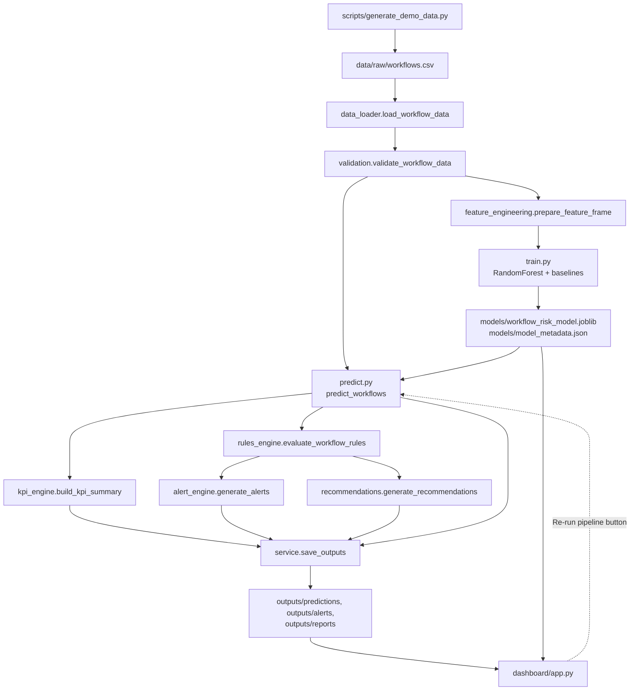
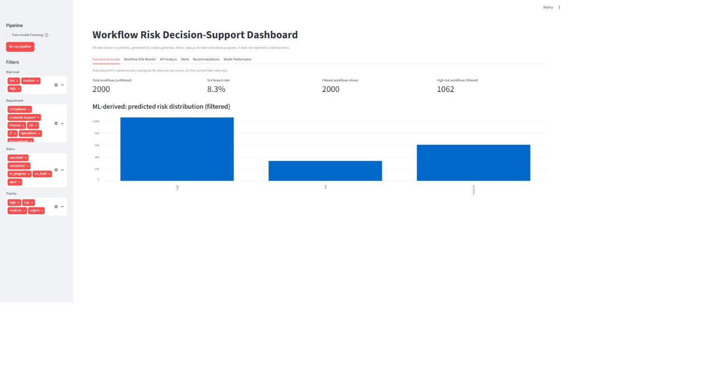
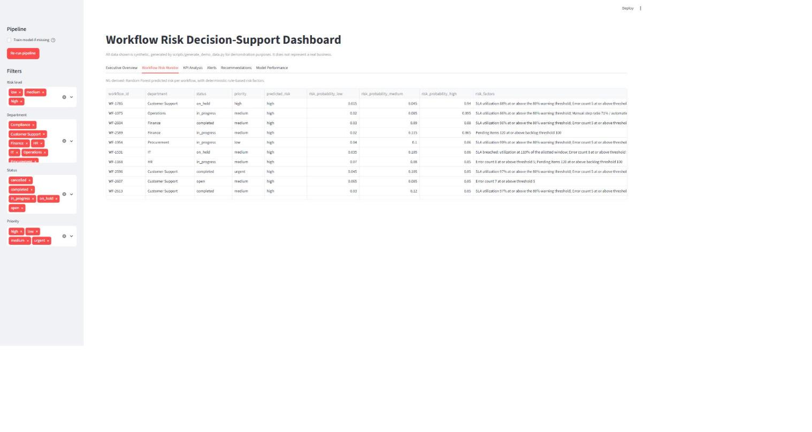
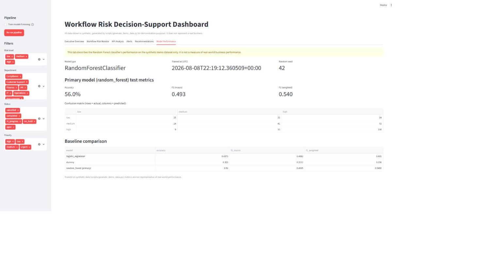

# Intelligent AI Workflow Automation for Business Operations

An operational decision-support system that predicts business-workflow risk
from structured process data, tracks KPIs and SLA compliance, and generates
deterministic alerts and recommendations — surfaced in a Streamlit dashboard
with a live re-run button.

---

## Overview

Business workflows (invoice processing, purchase-order approval, support
escalation, employee onboarding, claims processing, etc.) silently accumulate
SLA delays, manual-step overhead, errors, and rework until an operations team
discovers the problem after the fact — usually too late to act on cheaply.

This project is useful to **operations managers and analysts** who need a
proactive, explainable signal for which in-flight workflows need attention.
It combines:

- A **Random Forest classifier** that predicts per-workflow risk
  (`low`/`medium`/`high`) from operational signals.
- A fully **deterministic rules engine**, independent of the ML model, that
  computes KPIs, generates structured alerts, and produces category-tagged
  recommendations — each one traceable to an observed signal.

The final output is a **Streamlit dashboard** — 6 tabs, sidebar filters, and
a live re-run button — plus exportable CSV/JSON artifacts.

> **All data is synthetic**, generated by `scripts/generate_demo_data.py`.
> This is a demonstration/portfolio project, not a production system, and
> does not represent any real business. See [Limitations](#limitations).

---

## Why I Built This

I built this to practice designing and shipping a complete, multi-stage
operational ML product end to end — not just a notebook that trains a
model, but the full path from synthetic data generation through validation,
feature engineering, model training/evaluation, a deterministic
business-rules layer independent of the model, pipeline orchestration, and
a live dashboard — all under real git discipline (one linked GitHub issue →
branch → PR → CI → merge per unit of work, 8 builds, no direct commits to
`main`).

It also let me practice a specific design discipline I think matters in
real operational ML systems: keeping the **predictive** layer (the model)
and the **explanatory/decision** layer (the rules engine) strictly
separate, so that every alert and recommendation a user sees is backed by a
plain-English, threshold-based reason — never an opaque "the model said so."

---

## Key Features

- **Synthetic data pipeline** — a reproducible generator (`scripts/generate_demo_data.py`) with a fixed random seed and probabilistic (not rule-exact) risk labeling, specifically designed to avoid trivial leakage between the ML target and the rules engine's thresholds.
- **Leakage-safe feature engineering and training** — a single shared feature-preparation path used identically at training and inference time, with an explicit test proving leakage columns never reach the fitted model's input.
- **Random Forest risk classifier, benchmarked against baselines** — evaluated with accuracy/precision/recall/F1 (macro + weighted) and a confusion matrix, compared against Dummy and Logistic Regression baselines to demonstrate the model adds real value.
- **A deterministic, model-independent rules engine** — 7 explainable business rules driving structured alerts (with severity and a recommended action) and category-tagged recommendations, every threshold centralized in one config object.
- **A live operational dashboard** — 6 tabs, 4 sidebar filters, and a "Re-run pipeline" button that reruns the entire pipeline against fresh data on demand, with an explicit opt-in for retraining (never silent).
- **A tested, orchestrated pipeline** — one `service.run_pipeline` entry point used identically by the CLI and the dashboard, so there is exactly one way the pipeline runs, not two implementations to keep in sync.

---

## Tech Stack

- **Python 3.11**
- **pandas / NumPy** — data handling and feature engineering
- **scikit-learn** — Random Forest, Logistic Regression, Dummy baselines, preprocessing pipeline, evaluation metrics
- **joblib** — model persistence
- **Streamlit** — dashboard
- **pytest** — test suite (110 tests)
- **Git / GitHub / GitHub Actions** — issue-branch-PR-CI workflow, one linked issue per unit of work

Only libraries actually used in the shipped code are listed above.

---

## Project Workflow



In steps:

1. **Generate** a synthetic, clearly-labeled workflow dataset.
2. **Validate** it (required columns, nulls, out-of-range values, timestamp consistency) — fails loudly on error, never silently repairs data.
3. **Feature-engineer** 5 operational ratios (SLA utilization, manual-step ratio, error rate, rework rate, backlog pressure) via one shared path used identically at train and predict time.
4. **Train** a Random Forest classifier (plus Dummy and Logistic Regression baselines for comparison), evaluate, and persist the complete fitted pipeline.
5. **Predict** risk per workflow, with a rule-based (not model-internal) explanation for each prediction.
6. **Compute KPIs, alerts, and recommendations** through a rules engine that is completely independent of the ML model.
7. **Surface everything** in a Streamlit dashboard, with a button to rerun the whole pipeline live.

`service.run_pipeline` is the single orchestration entry point tying
together validation, prediction, KPIs, alerts, and recommendations; both
`scripts/run_pipeline.py` (CLI) and `dashboard/app.py` (the dashboard's
"Re-run pipeline" button) call it — there is exactly one pipeline
implementation, not two to keep in sync.

---

## Data Source

All data is **synthetic**, generated locally by
`scripts/generate_demo_data.py` — no external API, no real business data of
any kind. A latent per-row "risk propensity" drives correlated, noisy
operational signals (SLA utilization, error/rework rates, automation score,
backlog, etc.); the risk label is then *sampled* (not hard-thresholded)
from a soft, overlapping distribution over the 3 risk classes. This keeps
the ML target's derivation independent of the rules engine's hard per-field
thresholds, and leaves genuine class overlap so the classification task is
not artificially easy.

A full 2000-row dataset is generated to `data/raw/workflows.csv`
(gitignored, regenerate locally — see [How to Run](#how-to-run-the-project)).
A 20-row schema sample is checked into the repo at
`examples/sample_workflows.csv` so the schema is visible without running
anything.

### Dataset Schema

| Column | Type | Description |
|---|---|---|
| `workflow_id` | string | Unique identifier, e.g. `WF-1000` |
| `workflow_name` | string | Workflow type, e.g. "Invoice Processing" |
| `department` | categorical | Owning department |
| `status` | categorical | `open`, `in_progress`, `on_hold`, `completed`, `cancelled` |
| `priority` | categorical | `low`, `medium`, `high`, `urgent` |
| `sla_hours` | float | SLA window in hours |
| `elapsed_hours` | float | Hours elapsed since creation |
| `manual_steps` / `automated_steps` | int | Process step counts |
| `automation_score` | float [0,1] | Fraction of the process considered automated |
| `error_count` / `rework_count` | int | Errors / rework events recorded |
| `transaction_volume` | int | Transactions processed by this workflow instance |
| `avg_handling_time_minutes` | float | Average per-transaction handling time |
| `pending_items` | int | Items currently pending/backlogged |
| `completion_rate` | float [0,1] | Fraction of the workflow completed |
| `created_at` / `updated_at` | datetime | Timestamps |
| `risk_label` | categorical | Synthetic ground-truth risk, **training target only** |

**Leakage columns** — `risk_label`, `workflow_id`, `workflow_name`,
`created_at`, `updated_at` — are never used as model features. This is
enforced by construction (`prepare_feature_frame` only selects declared
feature columns) *and* proven by an explicit test asserting these columns
are absent from the **fitted** pipeline's own `feature_names_in_`, not just
from the feature-prep function's output.

---

## Feature Engineering

5 engineered ratios, each guarded against divide-by-zero (returns `0.0`,
never `NaN`/`inf`):

| Feature | Formula |
|---|---|
| `sla_utilization` | `elapsed_hours / sla_hours` |
| `manual_step_ratio` | `manual_steps / (manual_steps + automated_steps)` |
| `error_rate` | `error_count / transaction_volume` |
| `rework_rate` | `rework_count / transaction_volume` |
| `backlog_pressure` | `pending_items / transaction_volume` |

`prepare_feature_frame(df)` is the **single** feature-preparation path
(engineer features, then select the declared feature columns), used
identically by training and inference — so the two can never derive
features differently.

---

## Model Training & Evaluation

- **Model:** `RandomForestClassifier(n_estimators=200, random_state=42, class_weight="balanced")`, wrapped with a shared preprocessing step (median-impute + standard-scale numeric features; most-frequent-impute + one-hot encode categorical features).
- **Baselines:** `DummyClassifier(strategy="stratified")` and `LogisticRegression(max_iter=1000, class_weight="balanced")` — trained/evaluated identically, never persisted, comparison only.
- **Split:** stratified 80/20 train/test on `risk_label`, fixed seed.
- **Persistence:** the complete fitted pipeline (preprocessing + classifier) is saved as one `joblib` artifact, alongside a JSON metadata file (model type, timestamp, features, target, seed, row counts, test metrics, baseline comparison).

### Results (on the 2000-row synthetic dataset)

| Model | Accuracy | F1 (macro) | F1 (weighted) |
|---|---|---|---|
| Dummy (stratified) | 0.355 | 0.321 | 0.356 |
| Logistic Regression | 0.438 | 0.408 | 0.435 |
| **Random Forest (primary)** | **0.560** | **0.493** | **0.540** |

The Random Forest clearly outperforms both trivial baselines on this
synthetic dataset. **These numbers describe performance on synthetic data
only and are not representative of real-world predictive performance** —
see [Limitations](#limitations).

---

## Decision-Support Logic: KPIs, Rules, Alerts & Recommendations

This is the layer that makes every flag in the dashboard explainable, and
it runs completely independently of the ML model.

**KPIs** (`kpi_engine.py`) — volume (by status/department/priority), SLA
health (average utilization, breach rate, approaching-breach rate),
efficiency (manual ratio, automation score, completion rate, error/rework
rates), risk distribution, and a per-department breakdown.

**Rules** (`rules_engine.py`) — 7 deterministic rules, every threshold
sourced from one central config object (never a magic number):

| Rule | Condition | Severity |
|---|---|---|
| SLA breach | `sla_utilization >= 1.0` | critical |
| Approaching SLA | `sla_utilization >= 0.80`, not yet breached | warning |
| High error | `error_count >= 5` | warning |
| High rework | `rework_rate >= 0.10` | warning |
| Manual/automation opportunity | `manual_step_ratio >= 0.70` or `automation_score <= 0.30` | info |
| Backlog pressure | `pending_items >= 100` | warning |
| High-risk escalation | model `predicted_risk == "high"` | critical |

The first 6 rules run purely on a workflow's own fields; the 7th is the one
rule that depends on the model's prediction. `predict.py`'s per-prediction
explanation reuses the first 6 — **threshold-based reasoning over the row's
own fields, never a claim derived from the Random Forest's internal feature
importances**, since feature importance describes the whole trained model,
not any one prediction.

**Alerts** (`alert_engine.py`) — every triggered rule becomes a structured
alert (`alert_id`, `workflow_id`, `severity`, `type`, `message`,
`recommended_action`, `generated_at`), deduplicated within a run.

**Recommendations** (`recommendations.py`) — each triggered rule maps to
one of 8 categories (`escalate`, `review_sla`, `investigate_errors`,
`reduce_rework`, `assess_automation`, `rebalance_workload`, `monitor`,
`no_action`), always tied to an observed signal — never an unsupported
claim.

---

## Screenshots / Demo

**Executive Overview** — headline KPI metrics and the ML-derived predicted-risk distribution, filtered by the sidebar:



**Workflow Risk Monitor** — per-workflow predictions with per-class probabilities and rule-based risk factors:



**Model Performance** — explicitly labeled as describing model performance on synthetic data, not business performance, with the full baseline comparison:



---

## How to Run the Project

Requires **Python 3.11** (scikit-learn/streamlit compatibility).

```bash
git clone https://github.com/sanjay-dilip/intelligent-ai-workflow-automation.git
cd intelligent-ai-workflow-automation

python -m venv .venv
source .venv/Scripts/activate    # Windows Git Bash; use .venv/bin/activate on macOS/Linux
pip install -e ".[dev]"

# 1. Generate the synthetic dataset (2000 rows, fixed seed)
python scripts/generate_demo_data.py --rows 2000 --sample-rows 20

# 2. Train the Random Forest model (+ baselines for comparison)
python scripts/train_model.py

# 3. Run the full pipeline: predict -> KPIs -> alerts -> recommendations -> save outputs
python scripts/run_pipeline.py

# 4. Launch the dashboard
streamlit run dashboard/app.py
```

No secrets or API keys are required (see `.env.example`) — everything runs
on synthetic, locally-generated data.

`scripts/run_pipeline.py` accepts `--data-path` (default
`data/raw/workflows.csv`) and `--train-if-missing` (trains a model first if
none exists, rather than failing).

---

## Repository Structure

```
src/workflow_ai/       Core library: config, data loading, validation,
                        feature engineering, preprocessing, models, training,
                        evaluation, prediction, KPI/rules/alert/recommendation
                        engines, pipeline service, CLI
scripts/                CLI entry points (generate data, train, run pipeline)
dashboard/               Streamlit app
tests/                   pytest suite (mirrors src/workflow_ai/ modules)
docs/images/             Dashboard screenshots (this README)
data/raw/                Generated synthetic data (gitignored)
examples/                Checked-in schema sample (20 rows)
models/                  Trained model + metadata (gitignored)
outputs/                 Pipeline outputs: predictions, alerts, reports (gitignored)
```

---

## Testing

```bash
pytest -q
```

110 tests covering config, data loading, validation, synthetic data
generation, feature engineering, preprocessing, model training/evaluation,
prediction (including an explicit leakage-column test against the fitted
model), KPIs, rules (with boundary-condition tests at every threshold),
alerts, recommendations, and pipeline orchestration. CI (GitHub Actions)
runs the full suite on every pull request and push to `main`.

---

## What I Learned

- How to keep a predictive model and a deterministic rules layer cleanly
  separated, so every user-facing explanation is traceable to a plain
  threshold, not a black-box inference.
- The importance of a **single shared code path** (feature preparation,
  pipeline orchestration) used identically across training/inference and
  across CLI/dashboard entry points — and how quickly bugs creep in when
  that discipline slips (see the metadata-path bug found and fixed during
  Build 7, documented in the commit history).
- How to structure a genuinely multi-stage project (8 sequential builds)
  under real git discipline — one linked issue, branch, and PR per unit of
  work, with CI gating every merge.
- Practical leakage prevention: proving a property (leakage columns never
  reach the model) against the *fitted* object itself, not just against the
  function that's supposed to guarantee it.

---

## Future Improvements

- Add richer feature-importance / SHAP-based model diagnostics (kept
  strictly separate from the per-prediction rule-based explanations).
- Persist pipeline run history so KPI/alert trends can be tracked over
  time, not just the latest run.
- Deploy the dashboard publicly (e.g. Streamlit Community Cloud) for a
  no-install demo link.
- Expand the synthetic data generator to model workflow *sequences* over
  time, rather than independent snapshot rows.
- Add role-based severity thresholds (e.g. per-department SLA targets)
  instead of one global `RuleConfig`.

---

## Limitations

- **Synthetic data only** — no real business ever produced this data.
- **Model performance is not representative of real-world performance** —
  see [Model Training & Evaluation](#model-training--evaluation).
- **No production hardening** — no auth, no persistence beyond local
  CSV/JSON files, no monitoring/alerting integration.
- **`config.DATA_PROCESSED_DIR` is defined but currently unused** — reserved
  for a potential future processed-data caching step.
- **No irreversible or externally-visible automation** — alerts and
  recommendations are informational only.

---

## License

MIT — see [LICENSE](LICENSE).

## Contact

**Sanjay Dilip**
GitHub: [sanjay-dilip](https://github.com/sanjay-dilip)
Email: sanjaydilip7265@gmail.com
